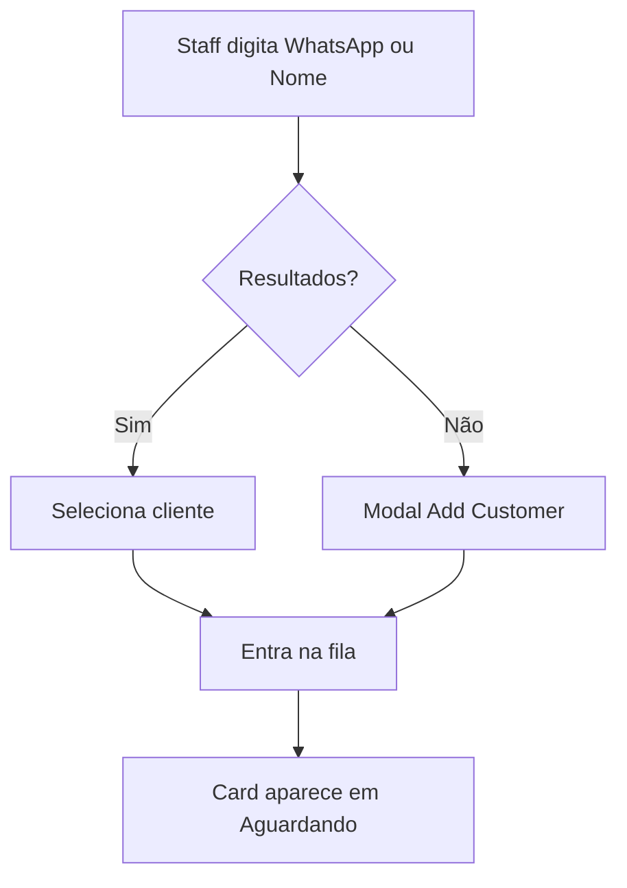
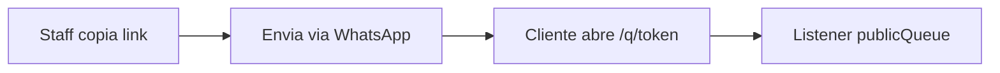

# Waitless — UX

## Dashboard Admin

Layout com identidade Waitless (Navy + Laranja):

- Sidebar fixa 220px (desktop) / drawer (mobile).
- Logo Waitless no topo da sidebar.
- Barra de busca central: *"Digite o WhatsApp ou Nome..."*
- Badge **AO VIVO** quando listeners Firestore estão conectados.
- Kanban de 2 colunas: **Aguardando** | **Em Atendimento**.
- Tema claro padrão; escuro opcional em Configurações.

## Proteção do navegador (Admin)

Extensões (Brave Shields, uBlock Origin, AdGuard) podem bloquear Firebase e impedir a fila de atualizar em tempo real.

### Aviso flutuante informativo

Card fixo no canto inferior direito, **não bloqueia** o painel:

- Texto curto explicando por que desativar a proteção para `waitless.solutions`.
- **Entendido** — dispensa o aviso na sessão atual (`sessionStorage`).
- **Saiba mais** — expande o card com passos detalhados (Brave, uBlock, recarregar página).

Sem detecção automática: o aviso aparece na primeira visita da sessão em produção.

**Rotas isentas:** login, signup, onboarding e fluxos em `/admin/auth/*`.

**Fora de escopo:** tela pública `/q/[token]`.

## Fluxo: busca rápida vs novo cadastro

- Debounce 300ms evita queries excessivas.
- Resultados aparecem abaixo da barra de busca.
- Clique no resultado = adicionar à fila imediatamente.

## Fluxo: transições de fila

| Ação | De | Para | UI |
|------|-----|------|-----|
| Iniciar | waiting | in_service | Botão no card Aguardando |
| Finalizar | in_service | completed | Botão no card Em Atendimento |
| Copiar link | waiting | — | Botão no card Aguardando (v0.2) |
| Detalhes | in_service | — | Placeholder v0.1 |

Cards em **Em Atendimento** exibem timer desde `startedAt`.

## Auth

- `/admin/signup` — cadastro com e-mail/senha ou Google (nome do estabelecimento obrigatório).
- `/admin/login` — login com e-mail/senha ou Google.
- `/admin/onboarding` — conclusão de cadastro para quem entrou com Google sem estabelecimento vinculado.
- Redirect automático se não autenticado ou sem `members/{uid}`.

## Cliente final (v0.2)

- Link único por entrada: `/q/{publicToken}`.
- Tela mobile-first com posição grande, progresso visual, ETA e alerta quando posição ≤ 2.
- Estados: `waiting`, `in_service` ("É a sua vez!"), link inválido/expirado.
- Sem login, sem app.
- Branding do estabelecimento (tagline, cor, logo) aplicado na tela.

## Configurações / White-label (v0.2)

- `/admin/settings` — nome, tagline, cor de destaque, URL da logo, tempo médio.
- Validação de contraste WCAG ao salvar cor.
- Toggle tema claro/escuro do painel admin.

## WhatsApp

Botão **Copiar link** ativo no card Aguardando (v0.2).  
Recepção copia e envia manualmente via WhatsApp.
